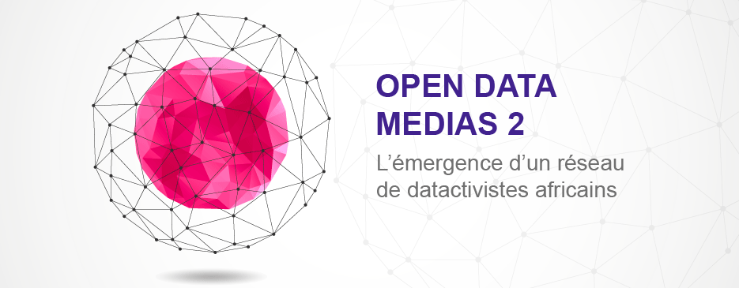

# Session de renforcement 2
Cette seconde session de renforcement de compétences du programme [Open Data Média 2](http://www.cfi.fr/fr/projet/opendata-medias-2) de CFI Médias vise à offrir aux participant·e·s une première approche d'outils performants d'extraction, traitement et datavisualisation. En pratique, ils seront initié·e·s aux fondamentaux du code par un apprentissage général de Python et introduit aux bases de la manipulation programmatique de données avec R.

Cette session est conçue et animée pour [CFI Médias](http://www.cfi.fr) par [Sylvain Lapoix](https://twitter.com/SylvainLapoix) (datajournaliste et formateur) au nom de [Datactivist](http://datactivist.coop/).

## Organisation
Une première session s'est tenue à Dakar du lundi 19 au mercredi 28 mars 2018.

Elle a réuni 8 participant·e·s :
* Mamadou Alfa Diallo (Guinée) ;
* Richard Komlan Folly (Togo) ;
* Paul-Joël Kamtchang (Cameroun) ;
* Annick Satou Kané (RCI) ;
* Fodé Sanikayi Kouyaté (Guinée)
* Madeleine Ngeunga (Cameroun) ;
* Fabienne Rafidiharinirina (Madagascar) ;
* Amadou Sy (Mauritanie).

Le second demi-groupe se réunira également à Dakar du lundi 23 avril au mercredi 2 mai 2018.

## Programme
- wip -
