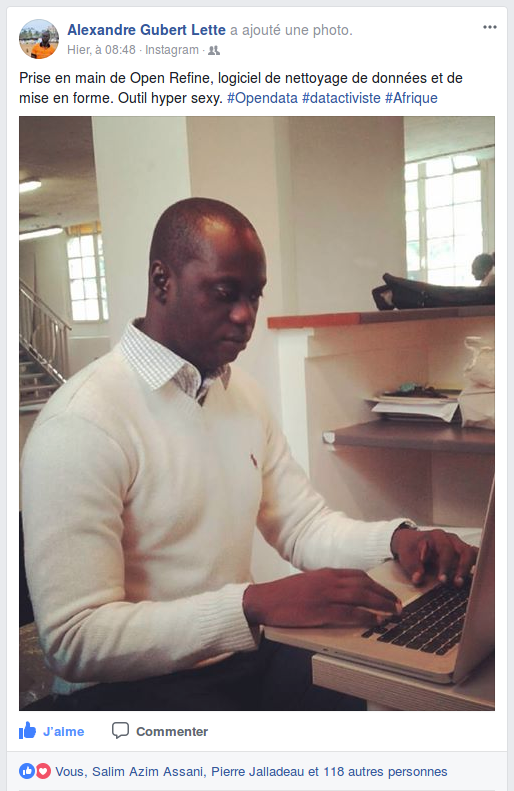

# Open Data Médias 2

### Le projet
Le projet [Open Data Médias 2](http://www.cfi.fr/fr/projet/opendata-medias-2) de l'agence de coopération média [CFI Médias](http://www.cfi.fr/) vise à permettre l'émergence d'un réseau de datactivistes en Afrique francophone. Son contenu et son animation sont assurés par Datactivi.st.

## Titre 2
### Titre 3

*ital* **gras**

_ital aussi_ __gras aussi__

Liste
- item A
- item B

Pour le CSS, penser à importer Droid serif avec :

`@import url(https://fonts.googleapis.com/css?family=Droid+Serif:400,700,400italic);`

On peut même faire des tables en *Markedown*

Markdown | HTML
------------ | -------------
*content* | <em>content</em>
**content** | <strong>content</strong>

[La liste des balises Markdown de base.](https://guides.github.com/features/mastering-markdown/)
